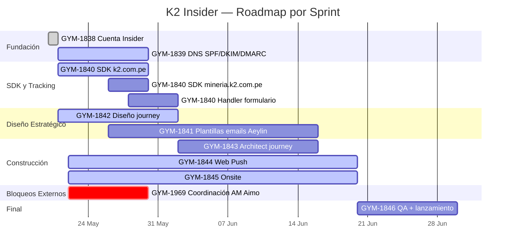

# MASTER_PLAN.md — K2 Insider Implementation

> **Objetivo raíz:** Activar el motor de captura y nurturing de leads B2B de K2 en Insider IN ONE antes del 30 de junio de 2026.
> Implementación completa de Email + Web Push + Onsite con perfilamiento conductual de decisores.

---

## 1. Estado General

| Campo | Valor |
|---|---|
| Proyecto | K2 Seguridad — Implementación Insider IN ONE |
| Cliente | K2 Seguridad y Resguardo SAC |
| Agencia | Aimo / Growthy y Marketing |
| Cuenta Insider | `k2aimo.inone.useinsider.com` (partnerId 10013744) |
| Épica Jira | GYM-1677 |
| Stack | Insider IN ONE · WordPress (k2.com.pe) · mineria.k2.com.pe |
| Estado global | 🟡 EN PROGRESO — bloqueo crítico SDK sin eventos |
| Deadline final | 2026-06-30 |
| Última actualización | 2026-05-26 |
| Maintainer | @aaronhuaynate66 |

---

## 2. Progreso General

```
Tickets épica         : 9 (GYM-1838 → GYM-1846)
Tickets adicionales   : 2 (GYM-1969 coordinación AM, GYM-1981 PRO Elements)
Tickets cerrados      : 1  (GYM-1838)
Tickets en curso      : 6  (GYM-1839, 1840, 1842, 1844, 1845, 1969)
Tickets por hacer     : 4  (GYM-1841, 1843, 1846, 1981)

Progreso técnico      : ████░░░░░░░░░░░░░░░░  ~22%
Progreso de diseño    : ████████████████░░░░  ~80%
Progreso global       : █████████░░░░░░░░░░░  ~45%
```

---

## 3. Timeline Visual (Mermaid Gantt)



---

## 4. Estado por Ticket

| Ticket | Nombre | Estado | Asignado | Deadline |
|---|---|---|---|---|
| GYM-1838 | Cuenta Insider creada y verificada | ✅ Cerrado | Aaron | 2026-05-21 |
| GYM-1839 | DNS — SPF/DKIM/DMARC | 🟡 En curso · DNS ✅, tests pendientes | Aaron | 2026-05-30 |
| GYM-1840 | SDK + atributos + segmentos | 🟡 En curso · SDK no envía eventos | Aaron | 2026-05-30 |
| GYM-1841 | Plantillas email (16 emails, 4 series) | ⬜ Por hacer · Brief entregado el 22/05 | Aeylin | 2026-06-16 |
| GYM-1842 | Diseño del journey B2B | 🟡 En curso · Entregables generados | Aaron | 2026-06-02 |
| GYM-1843 | Construcción journey en Architect | ⬜ Por hacer · Bloqueado por SDK y volumen | Aaron | 2026-06-16 |
| GYM-1844 | Web Push opt-in + 2 automatizaciones | 🟡 En curso · Diseño listo, SW bloqueado | Aaron | 2026-06-20 |
| GYM-1845 | Onsite — popup, banner, exit intent | 🟡 En curso · Diseño listo, ejecución bloqueada | Aaron | 2026-06-20 |
| GYM-1846 | QA completo + lanzamiento oficial | ⬜ Por hacer · Final | Aaron | 2026-06-30 |
| GYM-1969 | Coordinación AM Aimo + Insider One | 🟡 En curso · Sin respuesta hace 6 días | Aaron | 2026-05-26 |
| GYM-1981 | Bug PRO Elements en wp-admin (fuera de épica) | ⬜ Por hacer | Aaron | — |

---

## 5. Progreso por Ticket

### GYM-1838 — Cuenta Insider (✅ Cerrado)

| Subtarea | Descripción | Estado |
|---|---|---|
| 1.1 | Cuenta `k2aimo.inone.useinsider.com` activada | ✅ Cerrado |
| 1.2 | partnerId obtenido: `10013744` | ✅ Cerrado |
| 1.3 | Módulos Email, Web Push y Onsite verificados como activos | ✅ Cerrado |

```
GYM-1838 Progress: ████████████████████  100%
```

### GYM-1839 — DNS (🟡 En curso)

| Subtarea | Descripción | Estado |
|---|---|---|
| 2.1 | Dominio `k2.com.pe` agregado en Insider | ✅ Cerrado |
| 2.2 | 4 registros DNS generados por Insider | ✅ Cerrado |
| 2.3 | DNS publicados en GoDaddy (CNAME × 3 + DMARC TXT) | ✅ Cerrado |
| 2.4 | DNS verificados por Insider (todos ✅ Verified) | ✅ Cerrado |
| 2.5 | From email y From name configurados | ✅ Cerrado |
| 2.6 | Mail Tester >9/10 con correo de prueba real | ⬜ Bloqueado por volumen |
| 2.7 | Inbox placement >95% en Gmail, Outlook, Hotmail | ⬜ Bloqueado por volumen |

```
GYM-1839 Progress: ██████████████░░░░░░  71%
```

### GYM-1840 — SDK + atributos + segmentos (🟡 En curso · CRÍTICO)

| Subtarea | Descripción | Estado |
|---|---|---|
| 3.1 | 6 atributos custom creados | ✅ Cerrado |
| 3.2 | 7º atributo `urgencia_atencion` creado | ✅ Cerrado |
| 3.3 | 8 segmentos K2 creados (sin condiciones) | ✅ Cerrado |
| 3.4 | Tag SDK obtenido + InsiderQueue documentado | ✅ Cerrado |
| 3.5 | SDK instalado en k2.com.pe (WPCode) | 🔴 **Instalado pero sin enviar eventos** |
| 3.6 | SDK instalado en mineria.k2.com.pe | ⬜ Prompt enviado al contratista 25/05 |
| 3.7 | Handler `lead_captured` en formulario | ⬜ Bloqueado por contratista mineria |
| 3.8 | Condiciones reales en los 8 segmentos | ⬜ Bloqueado por datos vivos |

```
GYM-1840 Progress: ██████████░░░░░░░░░░  50%
```

### GYM-1841 — Plantillas email (⬜ Por hacer)

| Subtarea | Descripción | Estado |
|---|---|---|
| 4.0 | Brief de copywriting entregado a Aeylin | ✅ Cerrado |
| 4.1 | Serie A Reactivo (5 emails) | ⬜ Pendiente — deadline 31/05 |
| 4.2 | Serie B Analítico (5 emails) | ⬜ Pendiente — deadline 07/06 |
| 4.3 | Serie C Conservador (4 emails) | ⬜ Pendiente — deadline 14/06 |
| 4.4 | Serie D Operativo (4 emails) | ⬜ Pendiente — deadline 14/06 |
| 4.5 | Revisión + entrega final | ⬜ Pendiente — deadline 16/06 |

```
GYM-1841 Progress: ██░░░░░░░░░░░░░░░░░░  10%
```

### GYM-1842 — Diseño del journey (🟡 En curso)

| Subtarea | Descripción | Estado |
|---|---|---|
| 5.1 | Mecánica de scoring (3 preguntas + 3 bonos) | ✅ Cerrado |
| 5.2 | Algoritmo de clasificación a 4 perfiles | ✅ Cerrado |
| 5.3 | Diagrama vista ejecutiva (PPTX/PDF/Word) | ✅ Cerrado |
| 5.4 | Diagrama vista técnica con splits y delays | ✅ Cerrado |
| 5.5 | Cadencias por rama (5+5+4+4 = 18 toques) | ✅ Cerrado |
| 5.6 | Condiciones de salida del journey | ✅ Cerrado |
| 5.7 | Aprobación K2 antes del 02/06 | ⬜ Pendiente |

```
GYM-1842 Progress: ███████████████████░  86%
```

### GYM-1843 — Construcción Architect (⬜ Por hacer)

| Subtarea | Descripción | Estado |
|---|---|---|
| 6.1 | Crear journey con trigger `lead_captured` | ⬜ Bloqueado |
| 6.2 | Configurar split por `urgencia_atencion` | ⬜ Bloqueado |
| 6.3 | Configurar split por `perfil_decisor` (4 ramas) | ⬜ Bloqueado |
| 6.4 | Cargar 16 plantillas en el journey | ⬜ Bloqueado |
| 6.5 | Test end-to-end | ⬜ Bloqueado |
| 6.6 | Warm-up de envío (1-2 semanas) | ⬜ Bloqueado |
| 6.7 | Activación en producción | ⬜ Bloqueado |

```
GYM-1843 Progress: ░░░░░░░░░░░░░░░░░░░░  0%
```

### GYM-1844 — Web Push (🟡 En curso)

| Subtarea | Descripción | Estado |
|---|---|---|
| 7.1 | Diseño Soft Ask de opt-in | ✅ Cerrado |
| 7.2 | Diseño Automatización 1 (visitante /servicios 24h) | ✅ Cerrado |
| 7.3 | Diseño Automatización 2 (lead inactivo día 5) | ✅ Cerrado |
| 7.4 | Service Worker desbloqueado en Insider | ⬜ Bloqueado por SDK |
| 7.5 | Service Worker instalado en root k2.com.pe | ⬜ Bloqueado |
| 7.6 | Test Chrome + Edge + Firefox + Safari | ⬜ Bloqueado |
| 7.7 | Activación en producción | ⬜ Bloqueado |

```
GYM-1844 Progress: ██████░░░░░░░░░░░░░░  30%
```

### GYM-1845 — Onsite (🟡 En curso)

| Subtarea | Descripción | Estado |
|---|---|---|
| 8.1 | Diseño Popup de captura (Variantes A y B) | ✅ Cerrado |
| 8.2 | Diseño Banner para leads conocidos | ✅ Cerrado |
| 8.3 | Diseño Exit intent con caso de éxito | ✅ Cerrado |
| 8.4 | Lógica de prioridad entre 3 experiencias | ✅ Cerrado |
| 8.5 | Crear Popup en Insider (Passive) | ⬜ Pendiente — en cola |
| 8.6 | Crear Banner en Insider (Passive) | ⬜ Pendiente |
| 8.7 | Crear Exit intent en Insider (Passive) | ⬜ Pendiente |
| 8.8 | Activación en producción | ⬜ Bloqueado por SDK |

```
GYM-1845 Progress: █████████░░░░░░░░░░░  45%
```

### GYM-1846 — QA y lanzamiento (⬜ Por hacer)

```
GYM-1846 Progress: ░░░░░░░░░░░░░░░░░░░░  0%
```

### GYM-1969 — Coordinación AM Aimo (🟡 En curso · CRÍTICO)

| Subtarea | Descripción | Estado |
|---|---|---|
| 9.1 | Solicitud volumen 1.000 emails/mes a AM Aimo | ⏳ Sin respuesta · 6 días vencido |
| 9.2 | Solicitud cambio industria Retailers → Business Services | ⏳ Sin respuesta · 6 días vencido |
| 9.3 | Solicitud Double Opt-in a Insider One | ⏳ En review · SLA vencido (>3 días) |

```
GYM-1969 Progress: ░░░░░░░░░░░░░░░░░░░░  0%
```

---

## 6. Bloqueantes Actuales

| # | Bloqueante | Impacto | Acción requerida | Edad |
|---|---|---|---|---|
| **B1** | SDK instalado en k2.com.pe pero **no envía eventos a Insider** | Bloquea todo el tracking, segmentación viva, Web Push, validación de Onsite | Diagnóstico técnico inmediato: verificar System Rules, requests salientes, init event | 1 día |
| **B2** | Available Volume para k2aimo = **-100.000** | Impide enviar emails desde la cuenta. Bloquea GYM-1839 (tests), GYM-1843 (warm-up) | Escalada al AM Aimo, redistribuir desde eltablonarequipaaimo25 | 6 días |
| **B3** | Double Opt-in en **Pending Review** | Bloquea activación del journey en producción | Escalada al AM Aimo + Insider One (SLA prometido: 3 días) | 6 días |
| **B4** | Industria sigue como **Retailers** | Use Cases sesgados a e-commerce, benchmarks no aplicables | Coordinación con AM Aimo desde backend | 6 días |
| **B5** | SDK no instalado en **mineria.k2.com.pe** | Bloquea evento `lead_captured`, journey no se puede activar | Esperando respuesta del contratista (prompt enviado 25/05) | 1 día |
| **B6** | Aprobación K2 del journey | Bloquea cargar plantillas en Architect | Compartir PPTX con K2 y agendar revisión | 4 días |

---

## 7. Hitos Cerrados

| Fecha | Hito |
|---|---|
| 2026-05-20 | Cuenta Insider k2aimo activada, partnerId obtenido |
| 2026-05-21 | 6 atributos custom + 8 segmentos creados |
| 2026-05-22 | Diseño completo del journey + brief copywriting a Aeylin |
| 2026-05-22 | Generados 3 entregables (PPTX, PDF, DOCX) para aprobación K2 |
| 2026-05-25 | DNS publicado en GoDaddy y verificado por Insider (sin esperar IT) |
| 2026-05-25 | SDK instalado en k2.com.pe vía WPCode (sin esperar IT) |
| 2026-05-25 | 7º atributo `urgencia_atencion` creado |
| 2026-05-26 | Auditoría completa Insider — descubrimiento de B1 (SDK sin eventos) |

---

## 8. Decisiones Arquitectónicas (ADRs)

| ADR | Decisión | Contexto |
|---|---|---|
| ADR-001 | DNS gestionados directamente desde GoDaddy por Aaron, no por IT | Aaron tiene acceso de admin, IT estaba bloqueando avance |
| ADR-002 | SDK instalado vía plugin WPCode, no por edición de tema | Reversible, sobrevive cambios de tema, práctica estándar |
| ADR-003 | Scoring del formulario en frontend (JavaScript), no en backend | Reduce trabajo de IT, latencia menor, transparente para debug |
| ADR-004 | Subdominio técnico `em6900.k2.com.pe` para envío Insider | Aísla reputación del dominio principal sin trabajo extra |
| ADR-005 | NO publicar SPF de SendGrid en k2.com.pe | Insider opera por subdominio técnico, no requiere SPF en raíz |
| ADR-006 | Soft Ask para opt-in de Web Push, no nativo directo | Convierte ~12% efectivo vs 5% del nativo, justifica click extra |
| ADR-007 | Unbranded shortened links para tracking de email | Sin DNS adicional, activable inmediato, posible migrar después |
| ADR-008 | Double Opt-in en lugar de Single | Mejor deliverability con volumen bajo (290 leads/6 meses) |
| ADR-009 | Journey con 4 ramas (no 3 como en spec original) | Plan Maestro K2 define 4 perfiles, no 3 |
| ADR-010 | Routing del journey por `perfil_decisor` (no por `custom.puesto`) | Más preciso, mismo puesto puede tener distintas motivaciones |

---

## 9. Infraestructura

| Componente | Herramienta | Estado |
|---|---|---|
| Plataforma MarTech | Insider IN ONE (cuenta k2aimo) | ✅ Activo |
| ESP subyacente | SendGrid (vía Insider) | ✅ Activo |
| Sitio principal | WordPress 6.9.4 + Blocksy + Elementor | ✅ Activo |
| Sitio landing | mineria.k2.com.pe (stack desconocido) | 🟡 Tag por instalar |
| Hosting | GoDaddy Managed WordPress Pro10 | ✅ Activo |
| DNS | GoDaddy Premium DNS | ✅ Activo |
| Correo corporativo | Microsoft 365 / Outlook | ✅ Activo (no tocado) |
| Inyección de tags | Plugin WPCode | ✅ Activo |
| Tracking existente | Site Kit, Meta Pixel, Metricool | ✅ Coexisten |
| Cache de hosting | Redis Object Cache + System Plugin GoDaddy | ✅ Purgado |
| CRM K2 | (por confirmar) | ⬜ Pendiente integración |
| Logo K2 | Pendiente subir a Insider | ⬜ Pendiente |

---

## 10. KPIs del Proyecto

| KPI | Target | Actual |
|---|---|---|
| Leads capturados en 6 meses | 290 | 0 |
| Open rate del journey | ≥35% | — |
| Click rate del journey | ≥5% | — |
| Reply rate del journey | ≥2% | — |
| Inbox placement | ≥95% | — |
| Mail Tester score | ≥9/10 | — |
| Tasa opt-in efectiva Web Push | ≥12% | — |
| CTR push automático | ≥8% | — |
| Conversión popup Onsite | ≥3% | — |

---

## 11. Cómo Mantener Este Roadmap

1. **Al cerrar una subtarea:** Cambiar estado en la tabla del ticket de `⬜ Por hacer` → `🟡 En progreso` → `✅ Cerrado`, ajustar la barra de progreso.
2. **Al cerrar un ticket completo:** Cambiar estado en la tabla de tickets de `🟡 En curso` → `✅ Cerrado`.
3. **Al detectar un bloqueante nuevo:** Agregar fila en la sección Bloqueantes con impacto, acción requerida y fecha de detección.
4. **Al tomar una decisión técnica relevante:** Agregar fila en ADRs.
5. **Al cerrar un hito grande:** Agregar fila en Hitos Cerrados con fecha y descripción corta.
6. **Frecuencia de actualización:** Al final de cada sesión de trabajo o cuando cambia algo externo (IT, AM, K2 responde).
7. **Sincronización con Jira:** Este documento es la vista narrativa del proyecto. Los detalles operativos viven en Jira (épica GYM-1677).

---

## 12. Siguiente Acción Inmediata

```
🎯 ACCIÓN: B1 — Diagnosticar por qué el SDK no envía eventos a Insider
```

**Qué hacer:**

- Verificar en DevTools si hay requests salientes a `*.useinsider.com` desde k2.com.pe
- Confirmar si falta el push de `{type: 'init'}` en `InsiderQueue`
- Validar System Rules Generation y Website Mapping en Insider
- Descartar bloqueo de Cloudflare/GoDaddy/plugin de seguridad sobre llamadas salientes
- Si falta init, agregarlo al WPCode y limpiar cache

**Criterio de cierre:**

- [ ] Insider muestra ≥1 evento `page_view` en Event Analytics
- [ ] User Profiles muestra ≥1 perfil
- [ ] Onboarding Center marca Insider Tag Integration como ✅ Verified

**Paralelo (sin Claude in Chrome):**

- [ ] Escalada formal al AM Aimo por B2 + B3 + B4 (6 días vencido)
- [ ] Follow-up al contratista de mineria.k2.com.pe (24h vencido)
- [ ] Compartir PPTX del journey con K2 para arrancar aprobación

---

*Última actualización: 2026-05-26 · Maintainer: @aaronhuaynate66*
